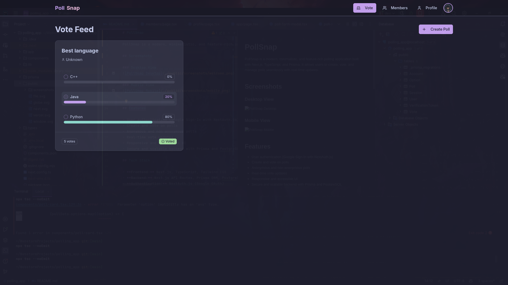

# PollSnap

<p align="center">
  
</p>

<p align="center">
  <em>A modern, minimalistic, and feature-rich polling application built with Next.js, TypeScript, and Prisma.</em>
</p>

PollSnap allows users to create, vote, and manage polls seamlessly with real-time updates. Whether you're gathering opinions or making decisions, PollSnap provides a sleek and intuitive experience.

## Screenshots

<div style="display: flex; flex-wrap: wrap; gap: 20px; justify-content: center;">
  <div style="text-align: center;">
    
    <p><strong>Feeds</strong></p>
  </div>
  <div style="text-align: center;">
    
    <p><strong>Members</strong></p>
  </div>
  <div style="text-align: center;">
    
    <p><strong>Profile</strong></p>
  </div>
</div>

## Features

<ul style="list-style-type: disc; padding-left: 20px;">
  <li><strong>User Authentication</strong>: Secure sign-in with Google using NextAuth.js.</li>
  <li><strong>Poll Creation & Voting</strong>: Easily create polls and cast votes.</li>
  <li><strong>Anonymous Polls</strong>: Option for anonymous or identified voting.</li>
  <li><strong>Real-Time Updates</strong>: See vote counts update instantly with SWR.</li>
  <li><strong>Responsive Design</strong>: Fully accessible and mobile-friendly UI.</li>
  <li><strong>Scalable Backend</strong>: Powered by Prisma and PostgreSQL for reliability.</li>
</ul>

## Tech Stack

<table style="width: 100%; border-collapse: collapse;">
  <tr>
    <th style="text-align: left; padding: 8px; border-bottom: 1px solid #ddd;">Category</th>
    <th style="text-align: left; padding: 8px; border-bottom: 1px solid #ddd;">Technologies</th>
  </tr>
  <tr>
    <td style="padding: 8px;">Frontend</td>
    <td style="padding: 8px;">Next.js, TypeScript, Tailwind CSS</td>
  </tr>
  <tr>
    <td style="padding: 8px;">Backend</td>
    <td style="padding: 8px;">Next.js API Routes, Prisma ORM, PostgreSQL</td>
  </tr>
  <tr>
    <td style="padding: 8px;">Authentication</td>
    <td style="padding: 8px;">NextAuth.js (Google OAuth)</td>
  </tr>
  <tr>
    <td style="padding: 8px;">State Management</td>
    <td style="padding: 8px;">SWR (for polling data fetching)</td>
  </tr>
</table>

## Installation

Follow these steps to set up PollSnap locally:

1. Clone the repository:
   ```bash
   git clone https://github.com/yourusername/pollsnap.git
   cd pollsnap
   ```

2. Install dependencies:
   ```bash
   pnpm install
   ```

3. Set up environment variables in `.env.local`:
   ```env
   DATABASE_URL=your_database_url
   NEXTAUTH_SECRET=your_secret_key
   GOOGLE_CLIENT_ID=your_google_client_id
   GOOGLE_CLIENT_SECRET=your_google_client_secret
   ```

4. Run database migrations:
   ```bash
   pnpm prisma migrate dev
   ```

5. Start the development server:
   ```bash
   pnpm dev
   ```

## Usage

- **Sign In**: Use your Google account to log in.
- **Create a Poll**: Click "Create Poll" and fill out the form.
- **Vote**: Browse the feed and vote on active polls.
- **Profile**: View your created polls and voting history.

## Contributing

Contributions are welcome! To contribute:

1. Fork the repository.
2. Create a new branch (`git checkout -b feature/your-feature`).
3. Make your changes and commit (`git commit -m "Add your feature"`).
4. Push to the branch (`git push origin feature/your-feature`).
5. Open a Pull Request.

## License

This project is licensed under the <a href="https://opensource.org/licenses/MIT" target="_blank">MIT License</a>.


<p align="center">
  Built with ❤️ by <a href="https://github.com/Jefino9488">Jefino</a>
</p>